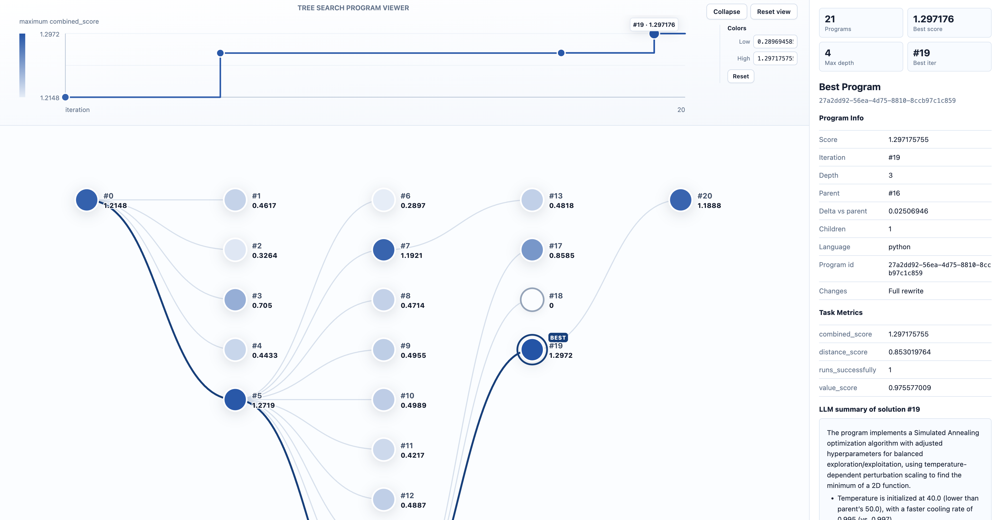
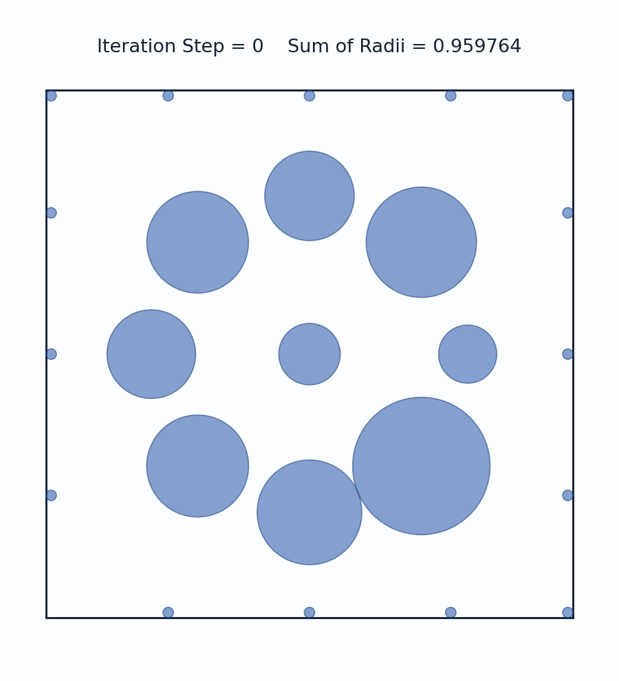

# Open Tree Search

Open Tree Search is a PUCT-based tree search algorithm for LLM-guided code evolution, built on top of [OpenEvolve](https://github.com/algorithmicsuperintelligence/openevolve). Tree search replaces OpenEvolve's nine-plus island-evolution hyperparameters with a single one that performs well out of the box.

The implementation follows the appendix of Google Research's [*An AI system to help scientists write expert-level empirical software*](https://arxiv.org/abs/2509.06503) ([blog post](https://research.google/blog/accelerating-scientific-discovery-with-ai-powered-empirical-software/)).

## How It Works

- **TreeNode**: tracks `depth`, `visits`, `children_ids`, `parent_id`.
- **PUCT selection** (`ucb_expand`): picks parents using rank-normalized scores plus an exploration bonus.
- **Backpropagation**: child evaluation increments visit counts up to the root.
- **Single knob**: `puct_exploration_constant` (default `1.0`) controls the exploration–exploitation trade-off, higher values favor under-visited branches.

## Installation

```bash
uv sync
```

## Configuration

The only tree-search-specific setting is `database.puct_exploration_constant`; everything else follows the [OpenEvolve config format](https://github.com/algorithmicsuperintelligence/openevolve).

Add your LLM info to `config.yaml`:

```yaml
llm:
  models:
    - name: "gemini-2.5-flash"
      api_base: "https://generativelanguage.googleapis.com/v1beta/openai/"
      api_key: "${LLM_API_KEY}"
```

Then `export LLM_API_KEY="..."` before running. The free Gemini tier works for the examples, get a key at https://aistudio.google.com/apikey.

## Examples

### Function Minimization

A toy example that evolves an optimization algorithm for a 2D function with many local minima.

```bash
uv run treesearch-run examples/function_minimization/initial_program.py \
  examples/function_minimization/evaluator.py \
  --config examples/function_minimization/config.yaml \
  --output output/func_min/run_1/
```

Example evolved tree (rendered with the tools in [Visualizing a Run](#visualizing-a-run)):



Open [tree_search_view.html](examples/function_minimization/tree_search_view.html) in a browser for the interactive version.

### Circle Packing (n=26)

Pack 26 circles in a unit square to maximize the sum of radii. [AlphaEvolve](https://arxiv.org/abs/2506.13131) reached 2.635 and [OpenEvolve](https://github.com/algorithmicsuperintelligence/openevolve/tree/main/examples/circle_packing) reached 2.634 in 200 iterations; we reach 2.632 in 121 iterations with `Qwen3-Coder-Next` using default settings.

<div align="center"></div>

```bash
uv run treesearch-run examples/circle_packing/initial_program.py \
  examples/circle_packing/evaluator.py \
  --config examples/circle_packing/config.yaml \
  --output output/circle_packing/run_1/
```

## Visualizing a Run

Each run writes checkpoints to `output/<run>/checkpoints/checkpoint_<N>/`. The tools below turn a checkpoint into a self-contained HTML page (open directly, no server).

### Optional: LLM summaries per node

Generates a per-program summary and parent-diff to `<checkpoint>/summaries/<program_id>.json`; the tree viewer auto-embeds them if present.

```bash
uv run python tools/generate_program_summaries.py \
  output/func_min/run_1/checkpoints/checkpoint_10 \
  --config examples/function_minimization/config.yaml
```

### Tree viewer

Embeds the program tree, per-node metrics, and source. Re-run after summaries to include them.

```bash
uv run python tools/generate_tree_search_view.py \
  output/func_min/run_1/checkpoints/checkpoint_10
# writes <checkpoint>/tree_search_view.html
```

## Repository Structure

- `opentreesearch/`: tree search implementation (TreeNode, PUCT selection, parallel workers)
- `tools/`: checkpoint-to-HTML viewer and optional LLM summarization
- `examples/`: `function_minimization/` and `circle_packing/`
- `tests/`

## License

Apache-2.0

This code is released as-is for research purposes, and should not be considered as a Genentech product. We do not guarantee that this code will be maintained or updated in the future.

Contributors: Max Shen, Amy Wang, Frances Ding, Jai Doshi, and Zach Wang
